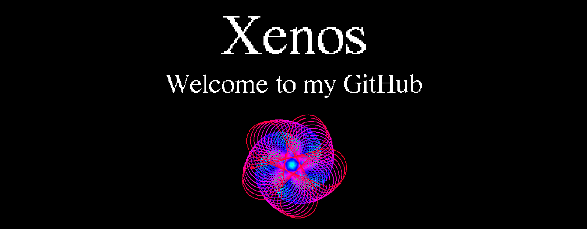

<h1 align="center">Hey! :wave:</h1>

  I am Xenos, a student learning how to code. This is my GitHub.

<h1 align="center">My Languages and tools</h1>

I know basic HTML, CSS, Python, Arduino, and a tad of C/C++. I am still learning!

<h1 align="center">Projects :computer:</h1>

I am currently working on LittlePinkEditor. Check it out in my repositories! 

